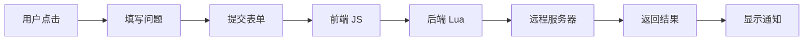

# 📚 图标上报功能 - 完整文档索引

> **为 luci-app-uninstall 添加用户上报图标问题的功能**

## 🎯 快速导航

| 文档 | 描述 | 适合对象 |
|------|------|---------|
| [快速开始.md](./快速开始.md) | 5分钟快速部署指南 | ⭐ 所有用户 |
| [功能实现总结.md](./功能实现总结.md) | 完整的功能说明和技术细节 | 开发者 |
| [图标上报功能说明.md](./图标上报功能说明.md) | 详细的功能特性和实现原理 | 产品经理/开发者 |
| [测试上报功能.md](./测试上报功能.md) | 测试方法和调试技巧 | 测试人员/开发者 |
| [后台API示例.md](./后台API示例.md) | 后台服务器实现示例代码 | 后端开发者 |

## 📦 修改的文件

```
luci-app-uninstall/
├── luasrc/controller/uninstall.lua           # ✏️ 已修改 - 后端控制器
└── htdocs/luci-static/resources/view/uninstall/
    └── main.js                                # ✏️ 已修改 - 前端页面
```

## 🚀 快速开始 (3 步)

### 1️⃣ 上传文件

```bash
# 上传到你的设备 (假设 IP 是 192.168.1.1)
scp luasrc/controller/uninstall.lua root@192.168.1.1:/usr/lib/lua/luci/controller/
scp htdocs/luci-static/resources/view/uninstall/main.js root@192.168.1.1:/www/luci-static/resources/view/uninstall/
```

### 2️⃣ 重启服务

```bash
ssh root@192.168.1.1 "rm -f /tmp/luci-* && /etc/init.d/uhttpd reload"
```

### 3️⃣ 测试功能

打开浏览器访问: `http://192.168.1.1/cgi-bin/luci/admin/vum/uninstall`

在应用图标右下角找到红色圆形按钮 (!) 并点击测试。

## ✨ 功能亮点

### 用户界面
- 🔴 **醒目的上报按钮**: 图标右下角红色圆形按钮
- 🎨 **精美的对话框**: 清晰的应用信息展示
- 📝 **可选的问题描述**: 用户可以详细说明问题
- 💬 **即时反馈**: 成功/失败通知

### 技术特性
- 📡 **自动上报**: 一键发送到后台服务器
- 🔒 **安全可靠**: 支持 CSRF Token 验证
- 🌐 **多客户端支持**: curl/wget/uclient-fetch 自动回退
- 📊 **完整的数据**: 包含设备信息和时间戳

### 数据采集
- 📦 **包名**: luci-app-xxx
- 💬 **用户评论**: 可选的问题描述
- 🕒 **时间戳**: 上报时间
- 🖥️ **设备信息**: 主机名、型号、系统

## 📖 文档说明

### 1. [快速开始.md](./快速开始.md)
**适合**: 第一次使用的用户

**内容**:
- ✅ 5分钟快速部署步骤
- 🎯 效果预览和界面示意
- 🔧 常见问题排查
- 📋 部署验证清单

**推荐阅读顺序**: 第一个阅读

---

### 2. [功能实现总结.md](./功能实现总结.md)
**适合**: 开发者和技术人员

**内容**:
- 📋 功能概述和实现细节
- 📁 修改的文件列表
- 🎨 用户界面设计
- 📡 数据流程图
- 🔧 技术栈说明
- 🚀 部署方法
- 🔮 未来改进建议

**推荐阅读顺序**: 第二个阅读

---

### 3. [图标上报功能说明.md](./图标上报功能说明.md)
**适合**: 产品经理和开发者

**内容**:
- 🎯 功能特点详解
- 💻 前端功能说明
- 🔌 后端接口文档
- 📊 上报数据格式
- 🔧 技术实现细节
- 💡 后续开发建议

**推荐阅读顺序**: 第三个阅读

---

### 4. [测试上报功能.md](./测试上报功能.md)
**适合**: 测试人员和开发者

**内容**:
- 🧪 快速测试步骤
- 🔍 手动 API 测试
- 🐛 调试技巧
- 📝 已知限制
- 🌐 后台服务器开发建议
- ❓ 常见问题解答

**推荐阅读顺序**: 测试时阅读

---

### 5. [后台API示例.md](./后台API示例.md)
**适合**: 后端开发者

**内容**:
- 📦 Node.js + Express 实现
- 🐍 Python + Flask 实现  
- 🔧 PHP 实现
- 🗄️ 数据库表结构
- 📧 通知集成示例
- 🌐 Nginx 配置

**推荐阅读顺序**: 需要搭建后台时阅读

---

## 🎓 学习路径

### 新手用户
1. 阅读 **快速开始.md**
2. 按步骤部署
3. 测试功能
4. 遇到问题查看故障排除部分

### 开发者
1. 阅读 **功能实现总结.md** 了解整体架构
2. 阅读 **图标上报功能说明.md** 了解详细设计
3. 阅读 **测试上报功能.md** 学习测试方法
4. 需要时参考 **后台API示例.md** 实现后台

### 后端开发者
1. 快速浏览 **功能实现总结.md** 中的数据格式部分
2. 重点阅读 **后台API示例.md**
3. 选择合适的技术栈实现
4. 参考 **测试上报功能.md** 进行接口测试

## 🔍 常见使用场景

### 场景 1: 快速体验功能
→ 阅读 [快速开始.md](./快速开始.md)

### 场景 2: 了解实现原理
→ 阅读 [功能实现总结.md](./功能实现总结.md)

### 场景 3: 定制化开发
→ 阅读 [图标上报功能说明.md](./图标上报功能说明.md)

### 场景 4: 调试问题
→ 阅读 [测试上报功能.md](./测试上报功能.md)

### 场景 5: 搭建后台
→ 阅读 [后台API示例.md](./后台API示例.md)

## 💻 代码位置速查

### 前端代码

**文件**: `htdocs/luci-static/resources/view/uninstall/main.js`

| 功能 | 行号范围 | 说明 |
|------|---------|------|
| 上报按钮创建 | ~508-530 | renderCard() 函数中 |
| 上报对话框 | ~1105-1180 | reportIcon() 函数 |
| 发送上报请求 | ~1160-1175 | _httpJson() 调用 |

### 后端代码

**文件**: `luasrc/controller/uninstall.lua`

| 功能 | 行号范围 | 说明 |
|------|---------|------|
| 路由定义 | ~41-43 | entry() 调用 |
| 上报处理函数 | ~末尾 | action_report_icon() |
| 数据构建 | 函数内 | 构建 JSON 数据 |
| HTTP 请求 | 函数内 | curl/wget/uclient-fetch |

## 📊 数据流程



## 🔧 配置项

### 前端配置

**上报按钮样式** (main.js ~508行):
```javascript
'style': 'position:absolute; bottom:0; right:0; width:18px; ...'
```

**对话框文本** (main.js ~1115行):
```javascript
_('上报图标问题')
_('问题描述')
_('提交上报')
```

### 后端配置

**上报地址** (uninstall.lua ~91行):
```lua
local report_url = 'https://tb.vumstar.com/api/report/icon'
```

**超时时间** (如需添加):
```lua
-- 可以在 sys.call() 中添加 timeout 参数
```

## 📈 数据示例

### 完整上报数据
```json
{
  "package": "luci-app-adguardhome",
  "comment": "图标显示模糊,建议更换高清版本",
  "timestamp": 1704067200,
  "device_info": {
    "hostname": "OpenWrt",
    "model": "aarch64",
    "system": "Linux"
  }
}
```

### 成功响应
```json
{
  "ok": true,
  "message": "图标问题已成功上报,感谢您的反馈!",
  "package": "luci-app-adguardhome"
}
```

## 🎯 开发检查清单

部署前确认:

- [ ] 文件已修改并保存
- [ ] 代码已测试无语法错误
- [ ] 上报地址已配置
- [ ] 文档已更新

部署后确认:

- [ ] 文件已上传到正确位置
- [ ] 服务已重启
- [ ] 功能可以正常使用
- [ ] 日志无错误信息

## 🆘 获取帮助

### 遇到问题?

1. **查看文档**: 按场景选择对应文档
2. **检查日志**: `logread -f | grep report`
3. **查看控制台**: 浏览器 F12 → Console
4. **网络请求**: 浏览器 F12 → Network

### 常见问题

- ❓ 看不到按钮 → [快速开始.md](./快速开始.md) 故障排除
- ❓ 点击无反应 → [测试上报功能.md](./测试上报功能.md) 调试技巧
- ❓ 提交失败 → 检查网络和后台服务器
- ❓ 如何定制 → [图标上报功能说明.md](./图标上报功能说明.md)

## 🎉 总结

### 已实现
✅ 前端上报按钮  
✅ 上报对话框  
✅ 后端接口  
✅ 数据上报  
✅ 成功/失败反馈  

### 待实现
⏳ 后台接收服务器 (参考 [后台API示例.md](./后台API示例.md))  
⏳ 数据统计和分析  
⏳ 管理后台  

---

**版本**: v1.0  
**更新时间**: 2025-11-07  
**状态**: ✅ 功能完成,文档齐全

**开始使用**: [快速开始.md](./快速开始.md) ⭐
